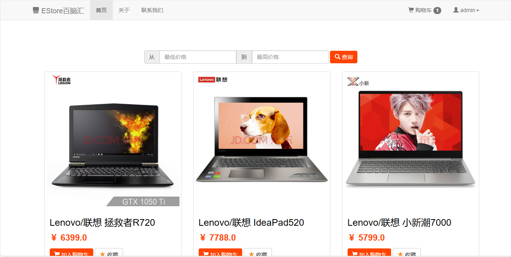
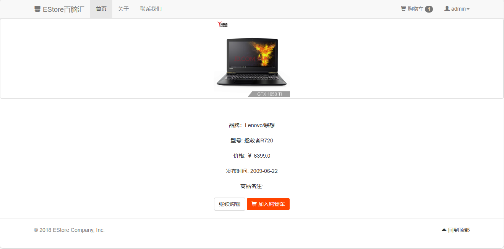
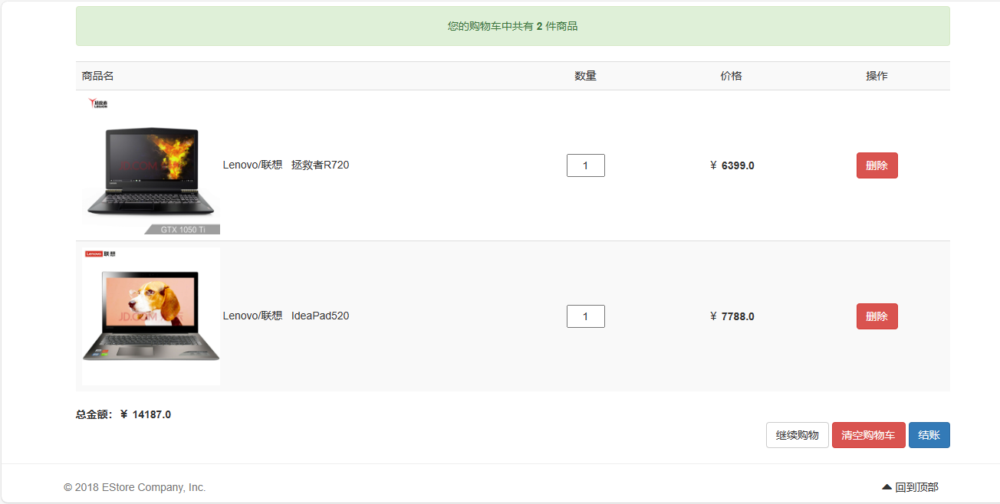
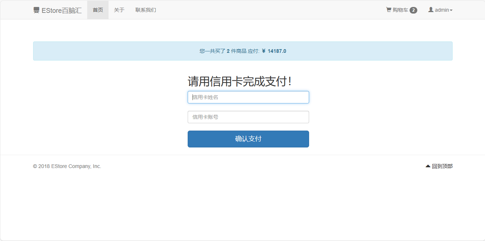

<h1 align="center">30.基于JavaWeb的百脑汇商城管理系统</h1>

 获取sql文件 QQ: 386869957 QQ群: 377586148 

 [推荐站点: 从戎源码网](https://armycodes.com/) 

## 简介

> 本代码来源于网络,仅供学习参考使用!
>
> 提供1.远程部署/2.修改代码/3.设计文档指导/4.框架代码讲解等服务

- ### 简介

  一个基于JavaWeb的网上电子商城项目,这个项目可以熟悉MVC开发模式，方便以后学习SSM等技术

- ### 使用技术
	* IDE：Eclipse
	* 数据库：MySQL
	* 数据源：C3P0
	* JDBC 工具：DBUtils
	* 前端框架：Bootstrap
	* Ajax 解决方案：jQuery + JavaScript + JSON + google-gson

- ### 快速上手
	- 在你的MySQL中创建一个名为estore的数据库（字符编码gb2312），导入使用我提供的estore.sql
	- 使用eclipse导入项目
	- 用到的jar包在WEB-INF/lib目录下，记得添加tomcat的jar包，build path即可
	- 修改src/c3p0-config.xml中的数据库账号密码
	- 在eclipse中配置好tomcat，run on server即可

## 环境

- <b>IntelliJ IDEA</b>

- <b>Mysql 5.7</b>

- <b>Tomcat 9.x</b>

- <b>JDK 1.8</b>

## 运行截图

 

